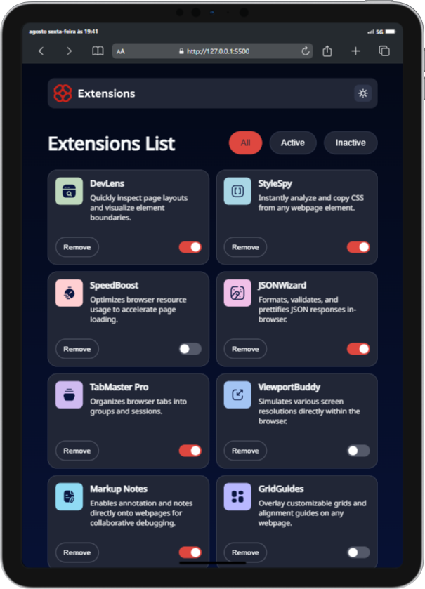
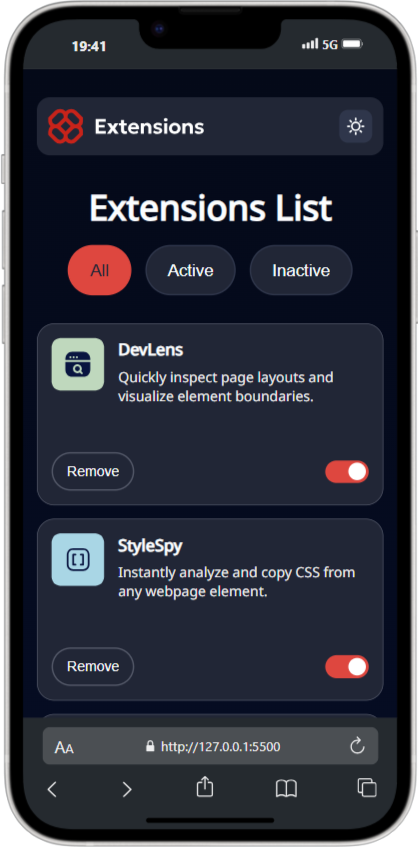
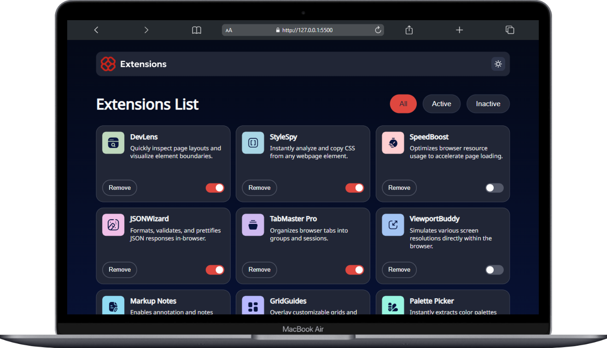
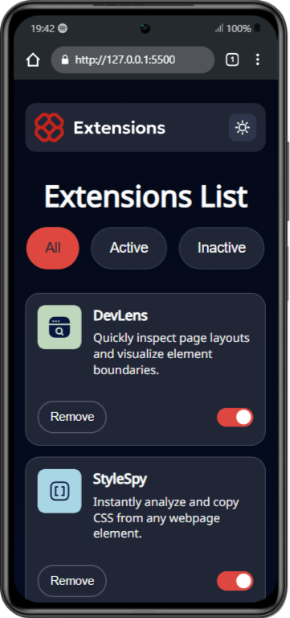

# Frontend Mentor - Solução de interface do usuário para gerenciador de extensões de navegador

Esta é uma solução para o [desafio de interface do usuário para gerenciador de extensões de navegador no Frontend Mentor](https://www.frontendmentor.io/challenges/browser-extension-manager-ui-yNZnOfsMAp).

## Índice

- [Frontend Mentor - Solução de interface do usuário para gerenciador de extensões de navegador](#frontend-mentor---solução-de-interface-do-usuário-para-gerenciador-de-extensões-de-navegador)
  - [Índice](#índice)
  - [Visão geral](#visão-geral)
    - [O desafio](#o-desafio)
    - [Captura de tela](#captura-de-tela)
  - [Meu processo](#meu-processo)
    - [Construído com](#construído-com)
      - [Pré-requisitos](#pré-requisitos)
  - [Autor](#autor)


## Visão geral

### O desafio

Os usuários devem ser capazes de:

- Alternar extensões entre os estados ativo e inativo
- Filtrar extensões ativas e inativas
- Remover extensões da lista
- Selecionar o tema de cores
- Visualizar O layout ideal para a interface, dependendo do tamanho da tela do dispositivo
- Ver os estados de foco e hover para os elementos interativos na página

### Captura de tela






## Meu processo

### Construído com

- Marcação semântica HTML5
- Propriedades personalizadas CSS
- Flexbox
- Grade CSS
- Fluxo de trabalho mobile-first
- JavaScript
- Babel
- Webpack

#### Pré-requisitos
- [Node.js](https://nodejs.org/) (versão LTS recomendada)  
- NPM (já vem com o Node)  ****

1. Clonar o repositório ou baixar o código
  ```git clone <url-do-seu-repo>```
  ```cd nome-do-projeto```
2. Instalar as dependências
  ```npm install```
3. Rodar em modo desenvolvimento
  ```npm run dev```
4. Gerar versão de produção
  ```npm run build```


## Autor

- [Portfólio](https://higor-costa.github.io/meu-portfolio/)
- [Gerenciador de Extensões](https://higor-costa.github.io/gerenciador-de-extensoes/)
- [Frontend Mentor](https://www.frontendmentor.io/profile/higor-costa)
